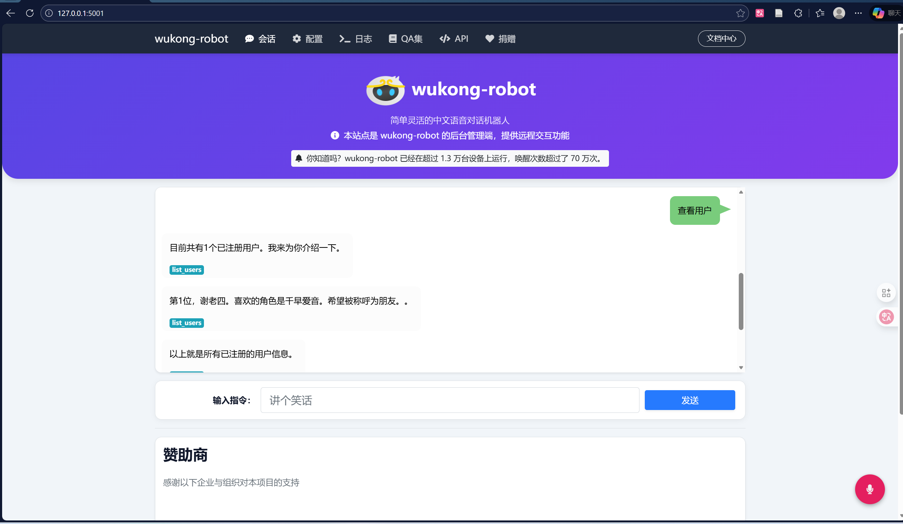

# 重制版：你的声音，我的回应

本项目基于开源语音助手wukong-robot框架的深度重构，强化了**声纹识别**、**混合抗噪 VAD**、**低延迟全链路监控**与**动态角色语音合成**。目标是让机器人不仅“听懂”指令，还能“听出”你是谁，并用你偏爱的声音即时回应。

## 📖 项目介绍

**“你的声音，我的回应”** 是本重制项目的核心理念。

传统的语音助手往往千篇一律，无法区分使用者。本项目通过集成 **ECAPA-TDNN 声纹识别模型** 与 **Faiss 向量检索**，赋予了机器人“识人”的能力。当不同用户唤醒机器人时，系统能毫秒级识别用户身份，并自动切换至该用户专属的 **角色语音（如动漫角色、特定音色）** 进行互动，真正实现了“千人千面”的沉浸式交互体验。

此外，针对开源语音助手常见的“听不清（抗噪差）”和“反应慢”问题，我们设计了 **混合式 VAD 静音检测** 策略与 **全链路延迟监控** 系统，确保在嘈杂环境下也能精准截断语音，且交互流畅无断音。

**核心亮点速览**
- **身份感知**：ECAPA-TDNN 声纹 + Faiss 检索，毫秒级识别并绑定个性化回复音色。
- **音质与情感**：Edge-TTS 极速播报 + GPT-SoVITS 少样本克隆，支持动漫角色化交互。
- **稳定低延迟**：混合抗噪 VAD 精准截断，全链路延迟监控与抖动预警保障顺滑对话。
- **现代化 UI**：极致重制的赛博风格前端管理页面，玻璃拟态设计，支持全流程一屏化管理。
- **扩展规划**：已制定详细的 6 个月功能扩展计划，覆盖智能家居、离线能力、多模态交互等方向。
- **开发者工具链**：提供交互式插件生成器 `tools/plugin_generator.py`，一键生成关键词/NLU/沉浸式插件模板。

## 🏗️ 系统架构

系统采用分层架构，自下而上覆盖硬件驱动、核心算法、业务逻辑与应用交互。

- **核心算法层**：腾讯云 ASR、百度 UNIT NLU、Edge-TTS / GPT-SoVITS 合成、ECAPA-TDNN 声纹识别。
- **数据流**：语音唤醒 -> VAD 采集 -> ASR 识别 -> 声纹/意图并行 -> 技能分发 -> 动态 TTS -> 播放。


## 🌐 后端管理界面

重制版对原有的后端管理界面进行了深度视觉美化与体验优化，采用现代化的 **"科技赛博风格"**与**"玻璃拟态设计"**，提供了极致的沉浸式交互体验。

### 界面特色
- **全屏自适应布局**：采用 Flexbox 技术，确保无需滚动即可在一屏内看到所有核心功能（机器人图标、历史对话、输入框）。
- **玻璃拟态卡片**：所有面板均采用半透明背景与背板模糊效果（Backdrop Blur），配合微光边框，营造出专业的科技感。
- **深邃暗色主题**：使用 `#0b0f19` 深色底色与径向渐变光晕，搭配品牌主题色（紫蓝渐变），呈现出 AI 时代的未来感。
- **类聊天软件交互**：对话气泡左右分布（用户右侧蓝色渐变、机器人左侧灰色），机器人消息附带头像，更具亲和力。
- **终端风格日志**：日志页面模拟真实终端，配有 macOS 风格的三色控制按钮与等宽字体。
- **圆角与动效**：输入框、按钮均采用大圆角设计，并配有悬停缩放、光晕呼吸等微动画。
- **深色模式适配**：API / 捐赠页表格与二维码增加暗色样式与占位符，确保内容可见、加载失败有友好提示。



## 📂 项目目录结构

主要目录结构如下：

```
wukong-robot/
├── wukong.py                # 项目启动入口
├── robot/                   # 核心逻辑库
│   ├── CharacterVoice.py    # 角色语音配置管理
│   ├── LatencyMonitor.py    # 全链路延迟监控
│   ├── VAD.py               # 混合 VAD 静音检测
│   ├── sdk/                 # 第三方 SDK 及声纹模型
│   └── ...
├── plugins/                 # 技能插件
│   ├── RegisterVoice.py     # 声纹注册插件
│   ├── VerifyVoice.py       # 声纹验证与角色切换
│   ├── ListUsers.py         # 列出当前已注册用户
│   ├── DeleteUser.py        # 删除用户
│   └── ...（共 18 个插件）
├── docker/                  # Docker 构建文件
├── docs/                    # 项目文档
│   ├── FEATURE_EXPANSION_PLAN.md  # 功能扩展计划（2026-01-30）
│   └── ...
├── static/                  # 静态资源与配置文件
│   ├── user_db.json         # 用户画像数据库
│   └── ...
├── tools/                   # 辅助工具
│   ├── character_voice_config.py # 角色语音配置工具
│   ├── user_manager.py      # 用户管理工具
│   ├── plugin_generator.py  # 交互式插件模板生成器
│   └── ...
└── requirements.txt         # 项目依赖列表
```

## ⚙️ 依赖安装

本项目基于 Python 3.7+ 环境。

1. **基础环境配置**
   
   先按原项目官方指引完成系统依赖（`pyaudio`, `sox`, `ffmpeg` 等）：
   👉 **[安装配置说明](https://wukong.hahack.com/#/install)**

2. **Python 依赖安装**

   完成基础环境后，安装重制版所需的 Python 库（含 `edge-tts`, `funasr`, `speechbrain` 等）：

   ```bash
   pip3 install -r requirements.txt
   #或者是用uv管理环境
   uv sync
   ```

## ✨ 项目特色

### 1. 🎤 声纹识别与用户注册
机器人不再是冷冰冰的机器，它能记住你的声音。
- **功能**：通过 `RegisterVoice` 插件，引导用户录入声纹并选择喜欢的角色（如“千早爱音”）。
- **技术**：基于 `ECAPA-TDNN` 提取 192 维声纹特征，利用 `Faiss` 进行向量存储与检索。

### 2. 🎭 动态角色语音切换
根据对话人不同，自动切换回复音色。
- **体验**：如果是“主人”唤醒，它也许会用温柔的二次元女声回应；如果是陌生人，则使用标准助手音。
- **引擎**：支持 `Edge-TTS`（轻量在线）与 `GPT-SoVITS`（高质量本地克隆）。

### 3. 🔇 混合式强抗噪 VAD
解决了传统 VAD 在噪杂环境下截断困难的痛点。
- **原理**：结合 **能量阈值 (RMS)** 与 **WebRTC VAD** 双重校验，实现“说话即录，停顿即止”，有效过滤风扇、键盘等背景噪音。

### 4. ⚡ 全链路延迟监控
实时追踪语音交互的每一环耗时，拒绝卡顿。
- **监控点**：覆盖 唤醒 -> ASR -> NLU -> 技能处理 -> TTS -> 播放 全流程。
- **告警**：自动检测 WebSocket 抖动，生成详细的延迟分析报告 (`temp/latency_reports/`)。

## 🚀 项目如何运行

1. 确保配置文件 `static/default.yml` (或 `~/.wukong/config.yml`) 已正确配置 ASR、NLU 等账号信息。

2. 在项目根目录下运行：

   ```bash
   python3 wukong.py
   ```

3. 首次启动建议先进行声纹注册：
   - 唤醒机器人（默认唤醒词"孙悟空"或"芝麻开门"）。
   - 说："**注册声纹**"。
   - 按照语音提示录入名字、喜欢的角色名。

4. 访问后台管理界面：
   - 默认地址：`http://localhost:5000`
   - 在浏览器中可进行远程对话、配置修改、日志查看、QA 数据集编辑等操作。

## 📝 示例结果

**场景：用户声纹注册与识别**

> **用户(陌生人)**：孙悟空。
> **机器人**：我在。
> **用户**：注册声纹。
> **机器人**：好的，请告诉我您的名字。
> **用户**：我是张三。
> **机器人**：收到，张三。请告诉我您喜欢的角色名称，例如“千早爱音”。
> **用户**：千早爱音。
> **机器人**：好的。请在听到滴声后，朗读以下内容......（录音中）......注册成功！

**场景：个性化回复**

> **用户(张三)**：孙悟空。
> **机器人(识别出张三，切换为千早爱音音色)**：是的，Master，有什么可以帮您？
> **用户**：唱首歌吧。
> **机器人(保持角色音色)**：好的，为您播放本地音乐。

## 🙏 致谢

本项目是在 **[wukong-robot](https://github.com/wzpan/wukong-robot)** (Author: [wzpan](https://github.com/wzpan)) 的基础上进行的二次开发与重制。

衷心感谢原作者构建了如此优秀、灵活且易于扩展的开源语音对话机器人框架，为本项目的重制与创新提供了坚实的基础。
